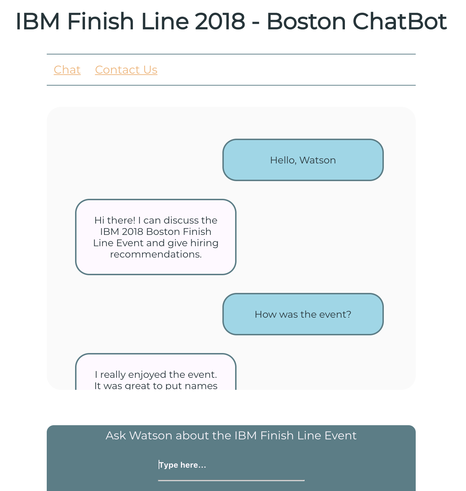

# ibm-watson-chatbot
IBM Finish Line 2018 Boston Feedback ChatBot.
Watson Assistant with a fully custom React/Redux front end 

Ask Watson about how the IBM Finish Line 2018 Event in Boston went.

## To run the application:
  ### Heroku Deployment
  The app has been deployed using Heroku and can be found at:
    
    https://protected-springs-53898.herokuapp.com/
  
  ### Run the application locally
  1. Clone the repository
  2. Make sure you have all the necessary node modules installed (this will need to be completed in both the client and server      directories)  
   a. To install modules open up the command line and type 
  
    npm install
    
  3. Navigate to the /server directory and create an application instance with Express.js server on http://localhost:5090/ and      React/Redux application served from http://localhost:3000/ with the command:
    
    npm run dev
      
  ### Chat with Watson (in Development)
  Discuss the IBM Finish Line 2018 Event with Watson. Greet Watson for a summary of his capabilities or ask questions like:
    
    Where was the event?
    How was the event?
    Who stood out at the event?
 
  And see what Watson has to say   
  

Note: This version of the application was made using create-react-app for configuration and setup. As a demonstration of familiarity with front end development, a vanilla version (no frameworks) of the client side code was created as well and can be found in the folder /vanilla
